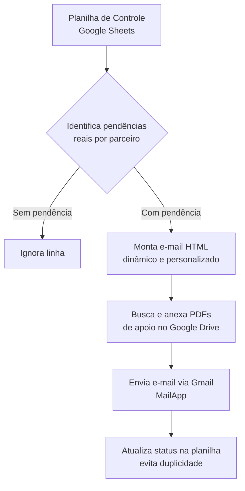
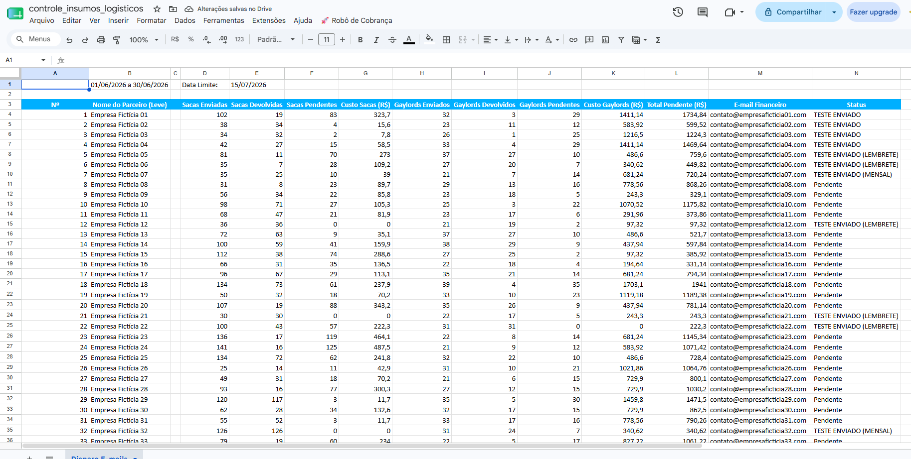
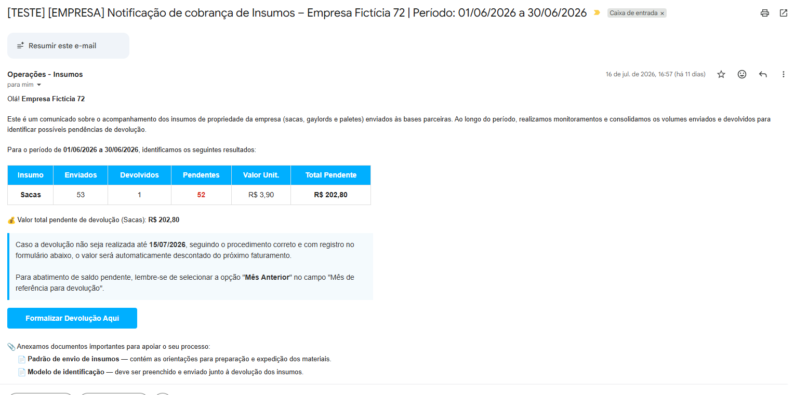
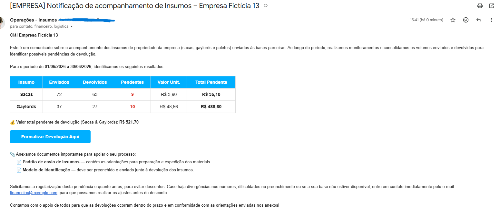

# 🚀 Automação de Faturamento e Cobrança com Google Apps Script

## 📌 Contexto do Negócio

A gestão de ativos logísticos (como sacas e gaylords) enviados a bases parceiras é crucial para evitar prejuízos financeiros. O processo de verificação de planilhas de inventário e cobrança de parceiros com pendências era manual, consumindo horas de trabalho da equipe e era suscetível a erros de digitação (valores e detalhes).

## 💡 A Solução

Desenvolvi um script em JavaScript (Google Apps Script) que automatiza 100% a comunicação financeira com os parceiros. O sistema atua como um "Robô de Cobrança" totalmente integrado ao ecossistema do Google Workspace (Google Sheets + Gmail + Google Drive).

A cada disparo, o robô:

1. Lê a planilha de controle de insumos
2. Identifica quais parceiros têm pendências reais (sacas e/ou gaylords não devolvidos)
3. Monta um e-mail em HTML personalizado, com tabela dinâmica e valores calculados
4. Anexa automaticamente os documentos de apoio (PDFs) do Google Drive
5. Envia o e-mail e atualiza o status da planilha, evitando cobranças duplicadas

## 🔁 Fluxo do Processo



## 🛠️ Tecnologias e Técnicas Aplicadas

- **Google Apps Script (JavaScript):** motor lógico de automação, rodando nativamente dentro do Google Planilhas
- **Interface Customizada (UI):** menu interativo (`onOpen`) direto na planilha, permitindo que qualquer pessoa da equipe dispare a automação com um clique — sem precisar abrir o editor de código
- **Geração de HTML dinâmica:** o corpo do e-mail é montado condicionalmente — só exibe a linha de "Sacas" ou "Gaylords" se houver pendência real, evitando poluir a comunicação com dados irrelevantes
- **Botão de call to action estilizado:** e-mail inclui um botão HTML (CSS inline) direcionando o parceiro para o formulário de regularização
- **Anexos automáticos via Google Drive:** integração com `DriveApp` para buscar e anexar PDFs de apoio (manuais/termos) automaticamente em cada envio, com tratamento de erro caso o arquivo não seja encontrado
- **Modo Sandbox (Teste):** rotinas de teste isoladas — tanto para disparo mensal quanto semanal — que enviam e-mails apenas para o e-mail do desenvolvedor, permitindo validar mudanças sem risco de notificar parceiros reais
- **Tratamento de Exceções:** uso de `try/catch` para que falhas pontuais de envio não interrompam a execução do robô para os demais parceiros

## 📁 Estrutura do Projeto

```
├── src/
│   ├── 01_configuracoes.js       → variáveis, mapeamento de colunas e parâmetros
│   ├── 02_geracao_html_emails.js → montagem do corpo HTML dos e-mails
│   ├── 03_menu_interface.js      → menu customizado na planilha (UI)
│   ├── 04_motor_execucao.js      → lógica principal de disparo e anexos
│   └── 05_utils.js               → funções auxiliares (formatação de moeda)
├── basedeados.ipynb              → notebook que gera a planilha de exemplo com dados fictícios
├── controle_insumos_logisticos.xlsx → planilha de exemplo pronta para testes
├── requirements.txt              → dependências Python do notebook
└── README.md
```

Os arquivos `.js` foram organizados por responsabilidade para fins de leitura no GitHub. Dentro do Google Apps Script, eles funcionam como abas de um mesmo projeto, compartilhando as variáveis globais entre si.

## 🧪 Como Testar

1. Suba o arquivo `controle_insumos_logisticos.xlsx` no Google Drive e abra com Google Planilhas
2. Vá em **Extensões → Apps Script** e cole o conteúdo dos 5 arquivos da pasta `src/`
3. No `01_configuracoes.js`, ajuste `MEU_EMAIL_DE_TESTE` para o seu e-mail
4. Recarregue a planilha e use o menu **🚀 Robô de Cobrança → 🧪 Teste Aleatório**

Para gerar uma nova planilha de exemplo do zero, abra o `basedeados.ipynb` (Jupyter/Colab), instale as dependências listadas em `requirements.txt` e rode as células.

## 📸 Exemplo em Funcionamento

**Planilha de controle** — cada linha é atualizada automaticamente após o disparo, evitando cobranças duplicadas:



**E-mail — Disparo Mensal (cobrança final):**



**E-mail — Disparo Semanal (lembrete):**



## 📊 Impacto Gerado

- Redução do tempo de execução do processo de **1h30 semanais para no máximo 3 minutos** (economia de mais de 96% de esforço operacional), atendendo a cerca de **200 bases parceiras**
- Eliminação total do esforço manual de conferência e envio de e-mails
- Redução a **zero (0%)** do índice de cobranças duplicadas, com atualização de status em tempo real
- Padronização da comunicação com parceiros, reduzindo erros de valores e detalhes
- Rastreabilidade total do processo diretamente na planilha

## 🔒 Nota sobre Dados

Este repositório utiliza exclusivamente dados fictícios, gerados pelo notebook `basedeados.ipynb`. Nenhuma informação real de empresas, parceiros ou e-mails é utilizada ou exposta. Todas as variáveis sensíveis (e-mails internos, IDs de arquivos do Drive, nome da empresa, link do formulário) foram substituídas por valores genéricos no código-fonte publicado.

---

Desenvolvido por **Lavínia Madeira**
